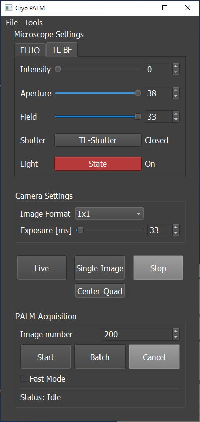
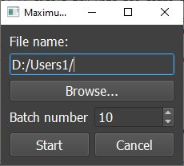
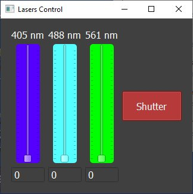
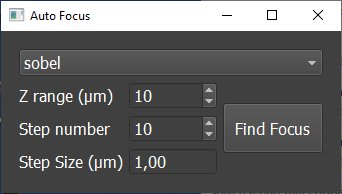
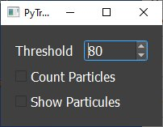
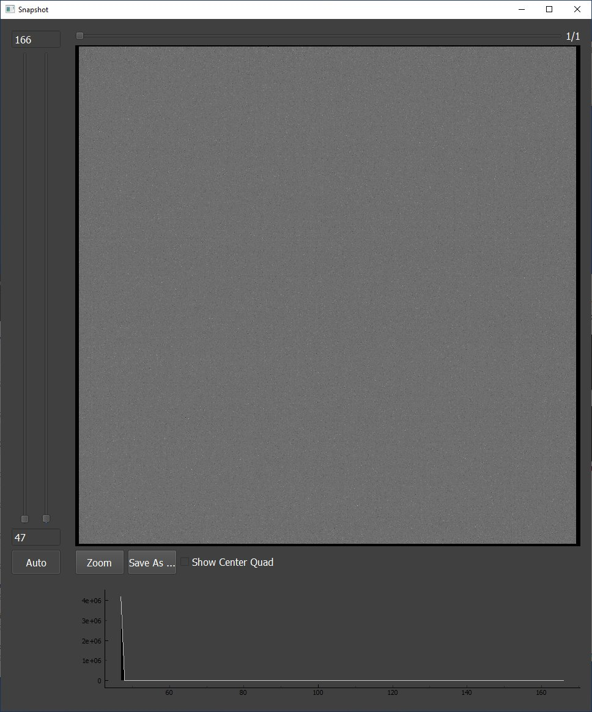

# CryoPALM

This program is made to control a microscopy setup aimed at imaging biological samples via PALM technique.
It allows to control the microscope (DM6000 from Leica), the camera (Hamamatsu DCAM, Photometrics Evolve) and the laser bench (homemade).
The microscope and the camera are controlled via the micromanager API and the lasers are controlled via communication with an Arduino board.

It allows to:

- Change microscope settings;
- Change camera settings;
- Acquire and display images in live or snapshot modes with grey levels histogram;
- Save acquired images;
- Find the best focus on the imaged area;
- Control the different laser powers independently;
- Perform PALM acquisition (single stream or batch).

# Installation instructions
1. Install [Micro-manager 2.0 beta](https://valelab4.ucsf.edu/~MM/nightlyBuilds/2.0.0-beta/Windows/MMSetup_64bit_2.0.0-beta3_20171106.exe) (I didn't try with other releases).
2. Download those files: https://github.com/zfphil/micro-manager-python3/tree/master/MMCorePy and drop them into your Micro-manager installation folder which should be something like ```C:\Program Files\Micro-Manager-2.0beta```.
3. Run the ```CryoPALMSetup.exe``` and follow the instructions until the installation is complete.
4. In order to use it with the laser controller module, you can check [This project](https://github.com/DocQuantic/SerialControlAnalogOutput) which uses an Arduino to control the laser bench.
5. By default, during launch, the program will check the file conf.txt contained in the configs folder of the installation directory. This file can be used for different things:

  - The first line contains the installation directory of your Micro-manager install;
  - The second line contains the default folder for saving;
  - The third line contains the name of the demo config file of Micro-manager;
  - On the following lines, you can add as many config file names as you wish. On startup, the program will search for those files in the configs folder of your CryoPALM installation directory. If it finds one, it will try to load it. If the program cannot find any file or cannot load any of the files that were found, it will automatically load the demo config file.
  
The program will work fine for Orca Flash 4 and Photometrics Evolve. If you want to load an other config, you might need to adapt the code subsequently.

# How to use it ?



Figure 1.1: Main Window
=======
## Main Window
When you run the program, the Main window will appear (Figure 1). This window is divided in three parts.


Figure 1: Experiment Window.

The first one contains all the elements to control the main characteristics of the microscope. It allows to select FLUO or BF mode and then to play with BF light intensity, diaphragms, filters and shutters.

The second one is dedicated to camera control. Exposure time and bining can be modified and it is possible to run acquisition (live or snapshot). You can also choose to image only the center quad of the camera for faster imaging.

Finally, the last part concerns the PALM acquisition itself. By default, it will only acquire the center quad. It is possible to modify the number of frames to be acquired and to run single or batch acquisitions. When batch acquisition is selected, it displays the batch acquisition window (Figure 2) which asks for the number of streams in the batch and the save location. By default, during a stream acquisition, only one image over ten will be displayed for speed purpose. Nevertheless, the PALM Acquisition part contains a checkbox to activate a "Fast Mode" which will display each frame acquired. This mode is very usefull to check fluorophore blinking and to adjust experiment parameters such as the laser powers, focus, etc...



Figure 2: Batch Window.

This window also has a menu ehich allows to close all viewers, to quit the app, and to pop tools windows such as :

- Laser control;
- Auto focus;
- Particules counter.

## Lasers control module
This module allows to control a laser bench composed of three lasers and a shutter.



Figure 3: Laser control window.

It's very simple to use. You just have to set the slider to the value of your choice between 0 and 100 %. To let the lasers out, don't forget to open the shutter.

## Auto focus module
This module is made to find the best focus of the region.



Figure 4: Auto focus module.

To use it, you have to select the focus calculation method among the ones that are available, select the range of the stack and the number of steps.

to have a better description of the different focus calculation methods, please refer to **Sun et al. Microscopy Research and Technique 65:139-149 (2004)**.

## Particules counter module
This module allows to detect single molecules during a stream acquisition an to display them on the viewer.



Figure 5: Particules counter module.

The only setting is the threshold for paticule detection. You can also chose to enable the display of the detections on the viewer. If the counting is enabled, a graph will appear at the begining of the acquisition showing the number of detected particules over time. This is used to monitor the detection number and to adjust it by changing the laser power.

## Image viewer
During acquisition, images will be displayed in the image viewer window.



Figure 6: Viewer window.

Image contrast and zooming can be performed on the fly during acquisitions and image histogram is constantly displayed. It is also possible to display the center quad area for sample positioning. Moreover, when the acquisition is stopped, images or stacks can be saved on the disk. Finally, if a Z-stack (auto focus) or a time series (stream) was acquired, it is possible to browse it once the acquisition is stopped with the slider located at the top of the window.

